# Laporan Proyek Machine Learning - Firda Humaira
## 1. Domain Proyek
Diabetes melitus (DM) adalah penyakit yang berkaitan dengan gangguan metabolisme, ditandai oleh peningkatan kadar glukosa dalam darah akibat berkurangnya produksi insulin oleh sel beta pankreas dan adanya gangguan atau resistensi terhadap insulin.

Diabetes melitus merupakan salah satu penyakit kronis yang berkontribusi signifikan terhadap angka kematian di Indonesia. Berdasarkan data dari Institute for Health Metrics and Evaluation (IHME), pada tahun 2019 diabetes tercatat sebagai penyebab kematian tertinggi ketiga di Indonesia, dengan tingkat kematian mencapai 57,42 per 100.000 penduduk. Selain itu, laporan dari International Diabetes Federation (IDF) menunjukkan bahwa jumlah penderita diabetes di Indonesia mengalami peningkatan yang signifikan dalam kurun waktu sepuluh tahun terakhir hingga tahun 2021.

Permasalahan ini menjadi sangat penting karena diabetes tidak hanya berdampak pada aspek kesehatan individu, tetapi juga menimbulkan beban ekonomi bagi negara akibat tingginya biaya pengobatan jangka panjang dan menurunnya produktivitas kerja penderita. Oleh karena itu, diperlukan upaya sistematis dalam pencegahan dan pengendalian diabetes, seperti peningkatan kesadaran masyarakat melalui edukasi gaya hidup sehat, deteksi dini melalui pemeriksaan rutin kadar gula darah, serta penguatan sistem layanan kesehatan dalam penanganan penyakit tidak menular.

## 2. Business Understanding
### 2.1 Problem Statements
1. Seberapa besar pengaruh kadar glukosa darah dan indeks massa tubuh (BMI) terhadap risiko seseorang menderita diabetes?
2. Apakah kombinasi kadar glukosa dan riwayat keluarga (Diabetes Pedigree Function) dapat digunakan untuk memprediksi diabetes secara akurat?
3. Bagaimana interaksi antara usia, kadar glukosa, dan BMI memengaruhi kemungkinan seseorang menderita diabetes?

### 2.2 Goals
1. Menentukan seberapa besar kontribusi kadar glukosa darah dan BMI dalam memprediksi risiko diabetes.
2. Mengetahui seberapa besar faktor genetik dan kadar gula darah berkontribusi terhadap diagnosis diabetes.
3. Menganalisis bagaimana ketiga faktor tersebut saling berinteraksi dalam mempengaruhi outcome diabetes.

### 2.3 Solution statements
1. Membangun model machine learning untuk mengukur kontribusi kedua faktor terhadap risiko diabetes, sehingga dapat diidentifikasi seberapa kuat pengaruh masing-masing variabel terhadap kondisi tersebut.
2. Membandingkan performa model dengan tuning optuna untuk menemukan model yang paling akurat dalam memprediksi risiko diabetes, kemudian menggunakan model terbaik tersebut untuk melakukan prediksi.
3. Melakukan analisis interaksi antara usia, kadar glukosa, dan BMI dalam membangun model prediktif, dengan tujuan memahami kontribusi gabungan ketiga variabel tersebut terhadap risiko diabetes dan memilih model terbaik berdasarkan metrik evaluasi yang terukur.

## 3. Data Understanding
Dataset yang saya gunakan diambil dari platform open source Kaggle dan dipublikasikan oleh paultimothymooney,_https://www.kaggle.com/code/paultimothymooney/predict-diabetes-from-medical-records/notebook_. Dataset ini berisi pengukuran yang berkaitan dengan Pregnancies, Glucose, BloodPressure, SkinThickness, Insulin, BMI, DiabetesPedigreeFunction, and Age.
| **Nama Variabel**            | **Deskripsi**                                                            |
| ---------------------------- | ------------------------------------------------------------------------ |
| **Pregnancies**              | Jumlah kehamilan yang pernah dialami pasien                              |
| **Glucose**                  | Konsentrasi glukosa plasma (mg/dL) dalam tes toleransi glukosa           |
| **BloodPressure**            | Tekanan darah diastolik (mm Hg)                                          |
| **SkinThickness**            | Ketebalan lipatan kulit triceps (mm)                                     |
| **Insulin**                  | Konsentrasi insulin serum dua jam (mu U/ml)                              |
| **BMI**                      | Indeks Massa Tubuh (kg/m²), dihitung dari berat badan dan tinggi badan   |
| **DiabetesPedigreeFunction** | Skor riwayat genetik diabetes (kemungkinan risiko berdasarkan keturunan) |
| **Age**                      | Usia pasien (dalam tahun)                                                |
| **Outcome**                  | Hasil diagnosis (1 = menderita diabetes, 0 = tidak menderita diabetes)   |

#### Info Dataset

  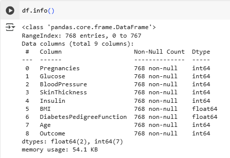

    insight:
    - Dataset ini semua variabel numeric, 2 kolom bertipe data float64 dan 7 kolom bertipe data int64. 
    - Tidak terdapat Missing Values di dataset ini.
    - Dataset terdiri dari 768 baris dan 9 bolom

### 3.1 Exploratory Data Analysis
#### 3.1.1 Distribusi Fitur pada Dataset Diabetes

  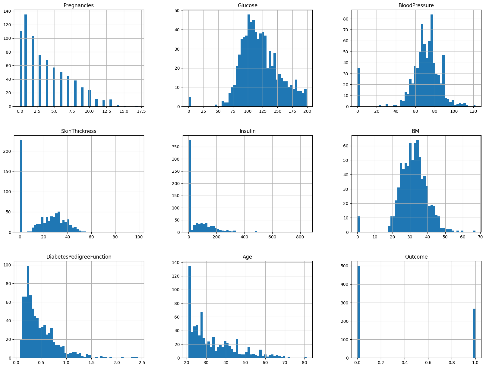

Gambar di atas menunjukkan histogram dari setiap fitur dalam dataset, informasi yang dapat dilihat:
- Beberapa fitur seperti `Insulin` dan `SkinThickness` mengandung banyak nilai nol yang mencurigakan.
- `BMI` dan `Glucose` menunjukkan distribusi yang cukup normal, namun mayoritas pasien memiliki BMI tinggi.
- `Outcome` menunjukkan distribusi kelas yang tidak seimbang, dengan lebih banyak pasien non-diabetik.

#### 3.1.2 Pairplot antar Fitur pada Dataset Diabetes

  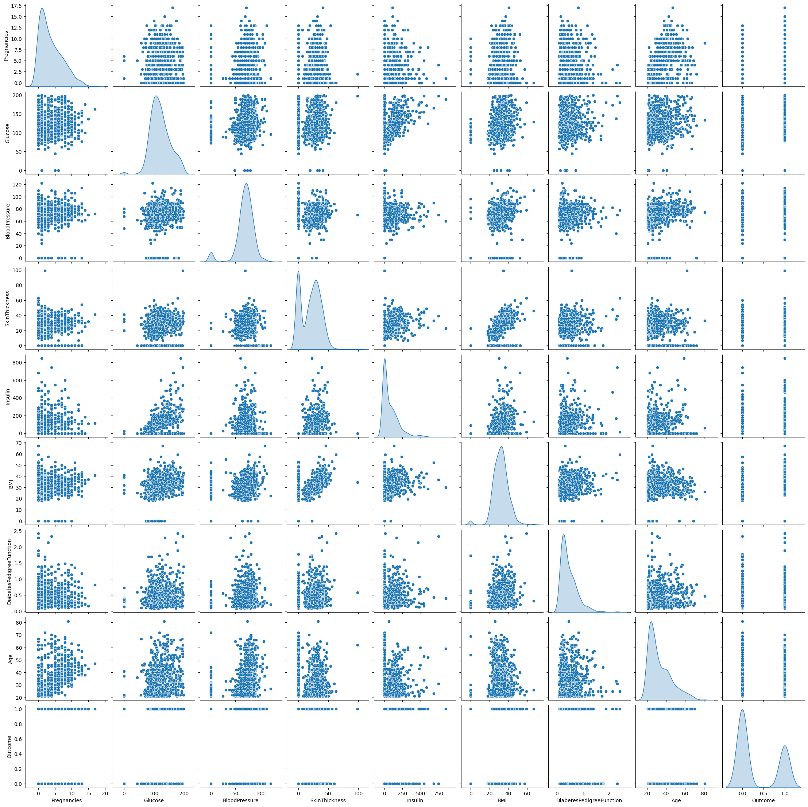

Gambar di atas menunjukan pairplot hubungan antara fitur-fitur dalam, informasi yang dapat dilihat:
- **Glucose** menunjukkan pemisahan yang cukup jelas antara pasien diabetes (`Outcome=1`) dan non-diabetes (`Outcome=0`). Kadar glukosa yang lebih tinggi cenderung dikaitkan dengan risiko diabetes.
- **BMI** (Body Mass Index) juga memiliki pola distribusi yang serupa, di mana pasien dengan nilai BMI lebih tinggi cenderung positif diabetes.
- **Age** memiliki korelasi moderat dengan `Outcome`, menunjukkan bahwa usia lebih tua cenderung berhubungan dengan peningkatan risiko.
- Korelasi antar fitur terlihat antara:
  - `Glucose` dan `Insulin`
  - `BMI` dan `SkinThickness`
  Korelasi ini ditunjukkan dengan pola menyudut pada scatterplot.
- Beberapa fitur seperti `BloodPressure` dan `DiabetesPedigreeFunction` tampak tidak memiliki hubungan yang kuat terhadap `Outcome`.

#### 3.1.3. Correlation Matrix pada antar Fitur pada Dataset Diabetes

  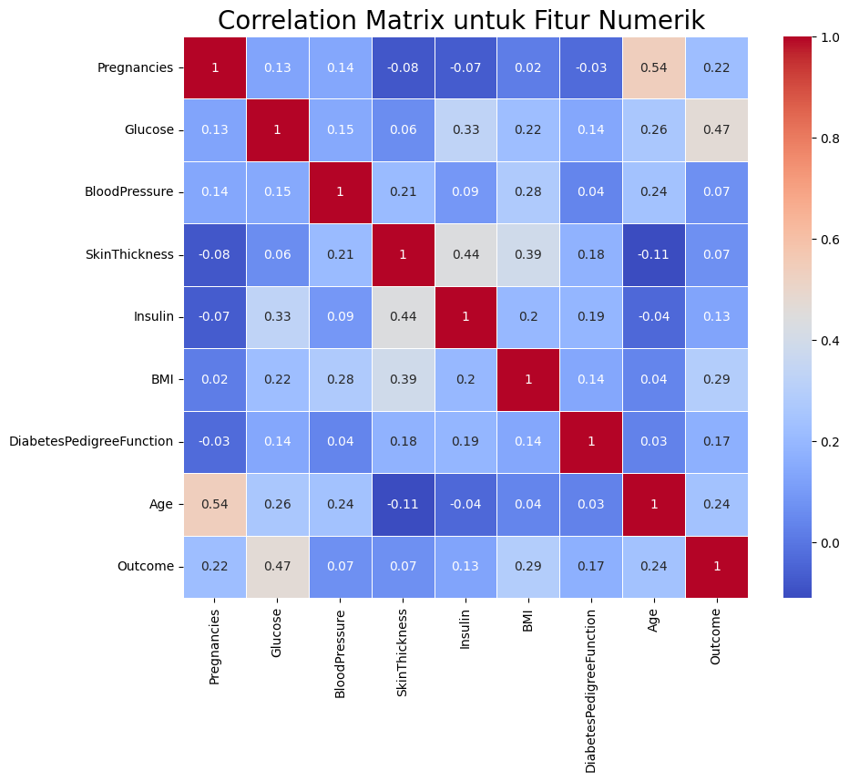

**insight:**
1. Korelasi terhadap Outcome

| Fitur                            | Korelasi dengan `Outcome` | Interpretasi                                                                   |
| -------------------------------- | ------------------------- | ------------------------------------------------------------------------------ |
| **Glucose**                      | **0.47**                  | Korelasi tertinggi → Semakin tinggi glukosa, semakin tinggi risiko diabetes |
| **BMI**                          | 0.29                      | Korelasi sedang → Obesitas berkontribusi terhadap risiko diabetes              |
| **Age**                          | 0.24                      | Semakin tua, risiko sedikit meningkat                                          |
| **Pregnancies**                  | 0.22                      | Wanita dengan lebih banyak kehamilan cenderung punya risiko lebih tinggi       |
| **DiabetesPedigreeFunction**     | 0.17                      | Ada pengaruh genetik, meskipun tidak terlalu kuat                              |
| **Insulin**                      | 0.13                      | Korelasi lemah, kemungkinan terpengaruh oleh banyak nilai nol                  |
| **BloodPressure, SkinThickness** | < 0.1                     | Korelasi sangat rendah → pengaruh terhadap diabetes lemah                      |

2. Korelasi antar Fitur

| Fitur 1           | Fitur 2           | Korelasi | Insight                                                                   |
| ----------------- | ----------------- | -------- | ------------------------------------------------------------------------- |
| **SkinThickness** | **Insulin**       | **0.44** | Cukup berkorelasi → menunjukkan hubungan biologis terkait metabolisme     |
| **BMI**           | **SkinThickness** | 0.39     | Individu dengan BMI lebih tinggi cenderung memiliki kulit lebih tebal     |
| **Glucose**       | **Insulin**       | 0.33     | Masuk akal, karena insulin berperan dalam regulasi glukosa                |
| **Pregnancies**   | **Age**           | **0.54** | Semakin tua, semakin banyak kemungkinan kehamilan (logis secara biologis) |

## 4. Data Preparation
### 4.1 Data Cleaning
#### 4.1.1 Missing Values dan Duplicated

  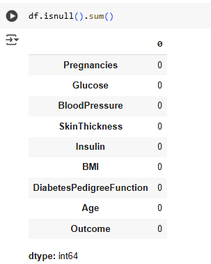

**insight:**

Tidak terdapat missing values di dataset ini.

  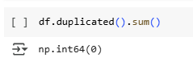

**insight:**

Tidak terdapat duplikasi data di dataset ini.

#### 4.1.2 Outlier

  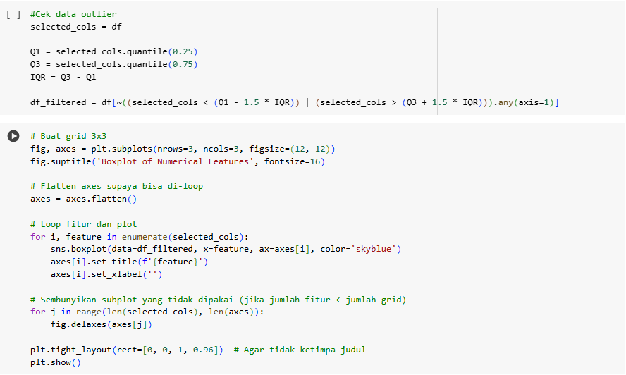

Akan menghasilkan output

  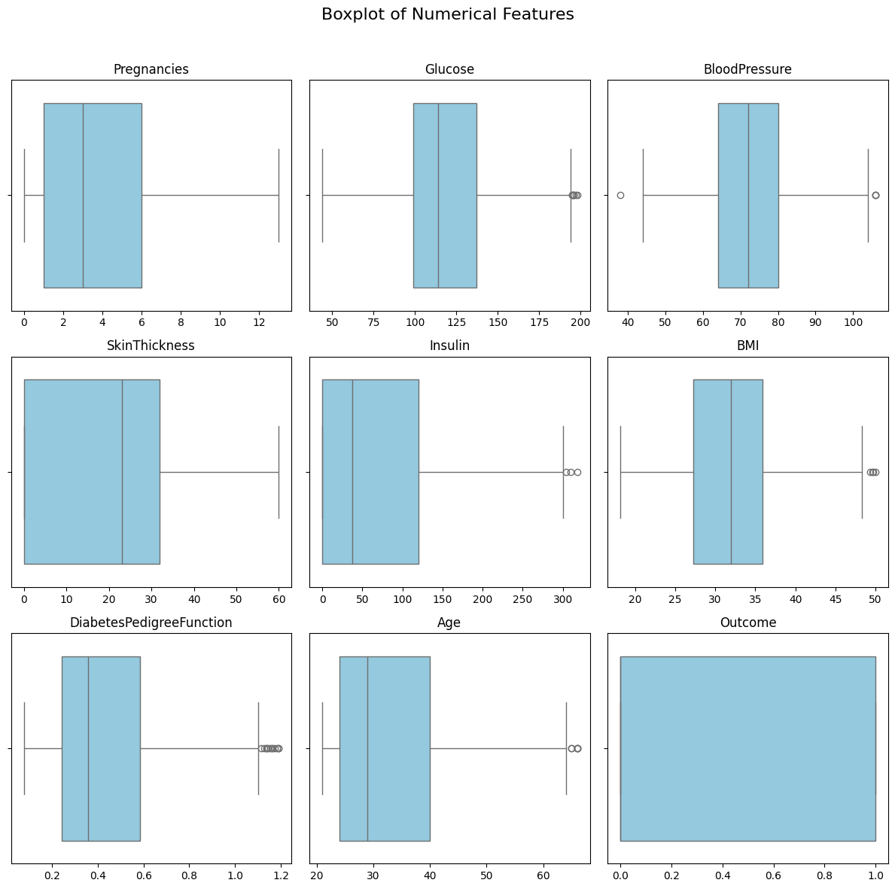

Terlihat ada variabel yang terdapat oulier, saya akan menghapus oulier tersebut.

  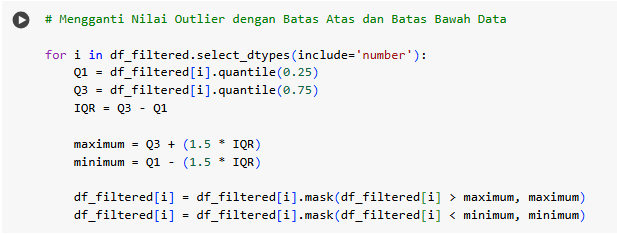

  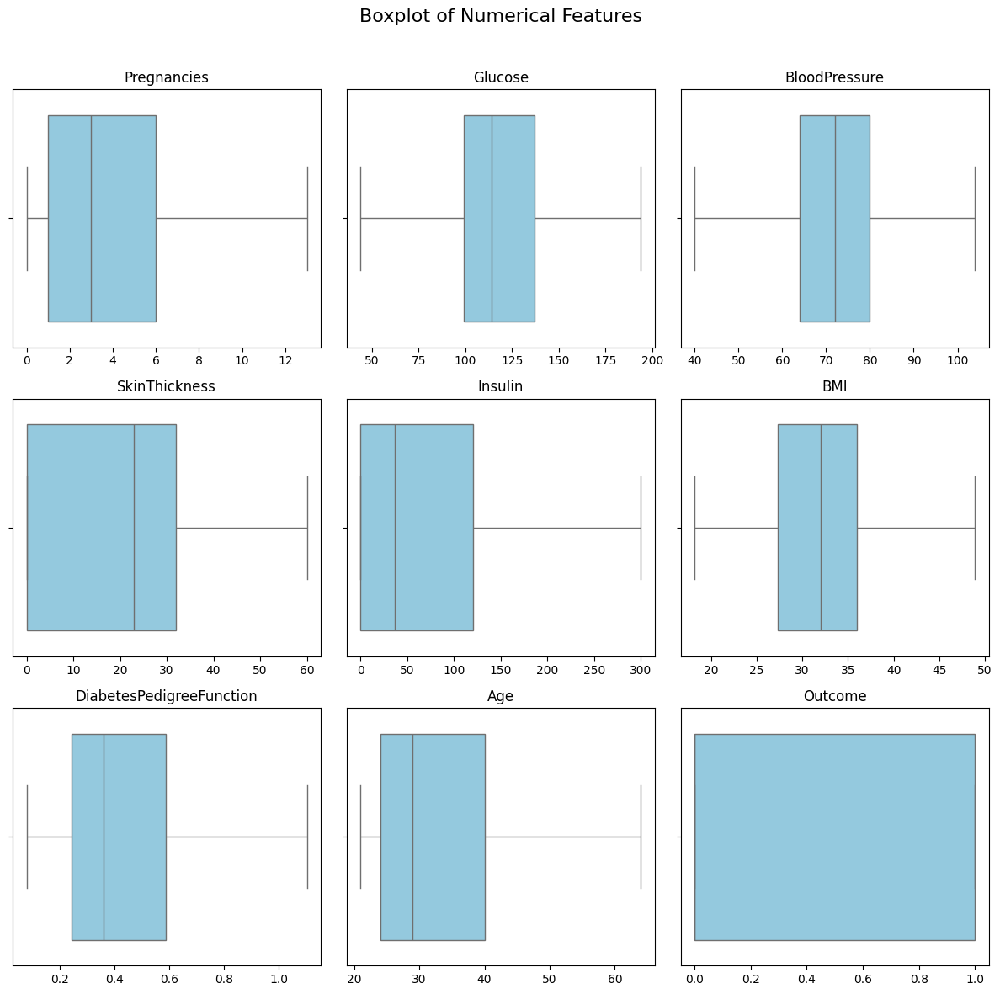

Oulier sudah tidak terdapat pada dataset ini.

### 4.2  Train Test Split
Train Test Split adalah teknik untuk membagi data menjadi data latih dan data uji. Data latih digunakan untuk melatih model, sementara data uji digunakan untuk mengukur performa model pada data baru.

Target pada dataset ini adalah variabel `Outcome` untuk mengetahui akurasi prediksi dari Outcome , maka akan menghapus kolom tersebut dari data dan assign kolom tersebut ke variabel baru. Selanjutnya, melakukan split data dengan skema data training sebesar 80% untuk melatih model dan 20% untuk menguji model.

  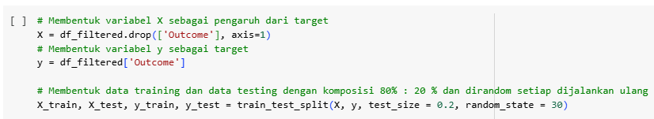

Tujuan Train-Test Split
- Memisahkan dataset df_filtered menjadi data latih (train) dan data uji (test).
- Komposisi: 80% untuk melatih model (train) dan 20% untuk menguji performa (test).
- random_state=30 digunakan agar pembagian data konsisten saat dijalankan ulang.

### 4.3  Normalisasi
**Tujuan Normalisasi**
1. Menyamakan skala fitur
  - Supaya fitur dengan skala besar (Insulin atau Glucose) tidak mendominasi fitur lain seperti BMI atau Age dalam proses training model.

2. Meningkatkan kinerja algoritma ML
  - Algoritma seperti K-Nearest Neighbors (KNN), SVM, dan Logistic Regression sensitif terhadap skala data. Tanpa normalisasi, performa model bisa menurun.

3. Mempercepat proses training
  - Karena perhitungan gradien atau jarak antar data menjadi lebih stabil dan efisien.

  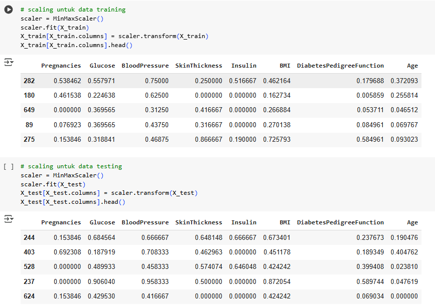

**insight:**

- Tidak ada lagi fitur yang dominasinya terlalu besar (Insulin atau Age yang sebelumnya punya nilai jauh lebih tinggi dari fitur lain).
- Model yang dilatih menggunakan data ini akan lebih stabil, cepat dilatih, dan hasil evaluasi lebih valid.

## 5. Modeling
Hasil Akurasi 4 Model yang saya pakai:
### 5.1 Model Development dengan K-Nearest Neighbor

- Cara kerja KNN

Algoritma K-Nearest Neighbors (KNN) bekerja dengan mencari K data terdekat dari data baru berdasarkan jarak (biasanya Euclidean, Euclidean adalah jenis pengukuran jarak paling umum dalam KNN. Ia mengukur jarak lurus (seperti penggaris) antara dua titik di ruang fitur.). Kelas data baru ditentukan dari mayoritas kelas tetangga terdekat tersebut. KNN tidak melakukan pelatihan model, sehingga seluruh proses terjadi saat prediksi, menjadikannya sederhana tapi lambat untuk dataset besar.

- Pembahasan Parameter

| Parameter     | Penjelasan                                                                                                                                                                                                      |
| ------------- | --------------------------------------------------------------------------------------------------------------------------------------------------------------------------------------------------------------- |
| `n_neighbors` | Jumlah tetangga terdekat yang digunakan dalam voting. Umumnya bernilai ganjil agar tidak terjadi tie. Nilai kecil → model sensitif terhadap noise. Nilai besar → model lebih halus tapi bisa kehilangan detail. |
| `weights`     | Memberikan bobot pada tetangga.   `'uniform'`: semua tetangga diberi bobot sama.   `'distance'`: tetangga lebih dekat diberi bobot lebih tinggi.                                                          |
| `algorithm`   | Metode pencarian tetangga.   `'auto'`: otomatis memilih yang terbaik.   `'ball_tree'`, `'kd_tree'`, dan `'brute'` adalah algoritma pencarian dengan karakteristik berbeda untuk efisiensi komputasi.      |

- Kelebihan dan Kekurangan KNN

| **Kelebihan**                                           | **Kekurangan**                                                    |
| ------------------------------------------------------- | ----------------------------------------------------------------- |
| Sederhana dan mudah dipahami                            | Lambat untuk dataset besar (butuh hitung jarak ke semua data)     |
| Tidak memerlukan pelatihan model (lazy learner)         | Sensitif terhadap skala fitur (perlu normalisasi/standardisasi)   |
| Cocok untuk data kecil dan distribusi jelas             | Sensitif terhadap noise dan outlier                               |
| Dapat digunakan untuk klasifikasi dan regresi           | Kinerja buruk di data berdimensi tinggi (curse of dimensionality) |
| Adaptif terhadap data baru (karena tidak dilatih ulang) | Memori besar karena menyimpan seluruh data latih                  |

### 5.2 Model Development dengan Random Forest

- Cara Kerja RF

Random Forest adalah algoritma ensemble yang membangun banyak pohon keputusan (decision tree) secara acak dari subset data dan fitur. Hasil akhir diambil berdasarkan mayoritas voting (untuk klasifikasi) atau rata-rata prediksi (untuk regresi) dari seluruh pohon. Teknik ini membantu mengurangi overfitting dan meningkatkan akurasi dibanding pohon tunggal.

- Pembahasan Parameter

| Parameter           | Penjelasan                                                                     |
| ------------------- | ------------------------------------------------------------------------------ |
| `n_estimators`      | Jumlah pohon dalam forest. Lebih banyak → lebih stabil tapi lebih lambat.      |
| `max_depth`         | Kedalaman maksimum tiap pohon. Batasi agar tidak overfitting.                  |
| `min_samples_split` | Jumlah minimum sampel untuk membagi node. Nilai besar → pohon lebih sederhana. |
| `min_samples_leaf`  | Jumlah minimum sampel di daun pohon. Cegah pohon terlalu detail.               |
| `max_features`      | Jumlah fitur yang dipakai tiap split (`sqrt`, `log2`, dll).                    |
| `random_state`      | Untuk hasil yang konsisten antar percobaan.                                    |

- Kelebihan dan Kekurangan RF

| **Kelebihan**                                          | **Kekurangan**                                                   |
| ------------------------------------------------------ | ---------------------------------------------------------------- |
| Akurasi tinggi dan tahan terhadap overfitting          | Lambat saat pelatihan dan prediksi, terutama dengan banyak pohon |
| Bisa menangani data besar dan fitur kompleks           | Interpretasi sulit (black-box model)                             |
| Robust terhadap outlier dan data noise                 | Perlu tuning banyak hyperparameter                               |
| Dapat menghitung pentingnya fitur (feature importance) | Bisa bias terhadap kelas dominan jika data tidak seimbang        |

### 5.3 Model Development dengan Logistic Regression

- Cara Kerja LR

Logistic Regression adalah algoritma klasifikasi yang memodelkan probabilitas suatu kelas menggunakan fungsi sigmoid. Model ini bekerja dengan mengestimasi bobot fitur untuk memaksimalkan pemisahan antara dua kelas. Output berupa probabilitas, lalu dikonversi menjadi label 0 atau 1 berdasarkan ambang batas tertentu.

- Pembahasan Parameter

| Parameter      | Penjelasan                                                                  |
| -------------- | --------------------------------------------------------------------------- |
| `C`            | Tingkat regularisasi (kebalikan dari kekuatan penalti), kecil → lebih kuat. |
| `penalty`      | Jenis regularisasi: `l1` (Lasso) atau `l2` (Ridge).                         |
| `solver`       | Metode optimasi: `liblinear` cocok untuk data kecil, `saga` untuk besar.    |
| `max_iter`     | Jumlah iterasi maksimum agar model konvergen.                               |
| `random_state` | Untuk menghasilkan hasil yang konsisten.                                    |

- Kekurangan dan kelebihan Lr

| **Kelebihan**                                | **Kekurangan**                                            |
| -------------------------------------------- | --------------------------------------------------------- |
| Sederhana dan mudah diinterpretasikan        | Tidak efektif pada data non-linear                        |
| Cepat dilatih, cocok untuk baseline model    | Rentan terhadap multikolinearitas antar fitur             |
| Memberikan output probabilistik (confidence) | Performa kurang untuk dataset kompleks dan tidak seimbang |
| Cocok untuk data kecil dan linier            | Hanya membentuk garis batas linier                        |

### 5.4 Model Development dengan Catboost

- Cara Kerja Catboost

CatBoost adalah algoritma gradient boosting yang dikembangkan oleh Yandex, dirancang khusus untuk menangani fitur kategorikal secara otomatis. Model ini membangun pohon keputusan secara bertahap dan setiap iterasi berusaha memperbaiki kesalahan dari iterasi sebelumnya. Keunggulan utama CatBoost adalah efisiensi, akurasi tinggi, dan minim overfitting meski tanpa preprocessing kompleks.

- Pembahasan Parameter

| Parameter       | Penjelasan                                                              |
| --------------- | ----------------------------------------------------------------------- |
| `iterations`    | Jumlah iterasi boosting (semakin besar → lebih kompleks).               |
| `depth`         | Kedalaman maksimum tiap pohon. Mempengaruhi kompleksitas model.         |
| `learning_rate` | Ukuran langkah pembelajaran. Kecil → lebih stabil, besar → lebih cepat. |
| `l2_leaf_reg`   | Regularisasi L2 untuk mencegah overfitting.                             |
| `border_count`  | Jumlah binning untuk fitur numerik. Lebih banyak → detil lebih tinggi.  |
| `random_state`  | Untuk konsistensi hasil antar percobaan.                                |

- Kelebihan dan Kekurangan Catboost

| **Kelebihan**                                                 | **Kekurangan**                                     |
| ------------------------------------------------------------- | -------------------------------------------------- |
| Menangani fitur kategorikal otomatis (tanpa one-hot encoding) | Dokumentasi dan komunitas belum sebesar XGBoost    |
| Akurasi tinggi dan tahan overfitting                          | Waktu pelatihan bisa lebih lama pada dataset besar |
| Tidak perlu preprocessing rumit                               | Sedikit lebih kompleks untuk dipahami              |
| Mendukung paralelisasi dan GPU                                | Parameter tuning cukup banyak                      |

#### Perbandingan Model

| Aspek                    | KNN                                                | Random Forest                                          | CatBoost                                                             | Logistic Regression                                                          |
| ------------------------ | -------------------------------------------------- | ------------------------------------------------------ | -------------------------------------------------------------------- | ---------------------------------------------------------------------------- |
| **Cara Kerja**           | Mencari tetangga terdekat berdasarkan jarak        | Gabungan banyak decision tree melalui voting mayoritas | Model boosting berbasis pohon yang mampu menangani fitur kategorikal | Model linier yang memetakan input ke probabilitas menggunakan fungsi sigmoid |
| **Kelebihan**            | Sederhana dan intuitif, non-parametrik             | Akurat, robust terhadap overfitting                    | Akurat, minim preprocessing, mampu menangani data kategorikal        | Cepat, ringan, mudah ditafsirkan                                             |
| **Kekurangan**           | Lambat pada dataset besar, sensitif terhadap noise | Interpretasi sulit, butuh tuning banyak                | Kompleks, waktu training relatif lama, kurva belajar curam           | Tidak cocok untuk hubungan non-linear                                        |
| **Tuning Utama**         | n\_neighbors, metric                               | n\_estimators, max\_depth, min\_samples\_split         | iterations, depth, learning\_rate                                    | C, penalty, solver                                                           |
| **Cocok Untuk**          | Dataset kecil dan sederhana                        | Dataset besar dan kompleks                             | Klasifikasi tabular kompleks                                         | Dataset linier dan kecil                                                     |
| **Waktu Training**       | Sangat cepat karena tidak membutuhkan training     | Sedang hingga lama tergantung parameter                | Cenderung lama karena proses boosting                                | Sangat cepat                                                                 |
| **Kemampuan Non-Linear** | Baik jika nilai k tepat                            | Sangat baik                                            | Sangat baik                                                          | Lemah                                                                        |

## 6. Evaluation
Dalam proyek ini, evaluasi model dilakukan dengan menggunakan confusion matrix, akurasi, dan f1 score sebagai metrik penilaian untuk setiap model. Sebelum itu, akan dijelaskan terlebih dahulu cara menghitung akurasi dan f1 score serta cara memanfaatkan confusion matrix.

**Mengukur ketepatan prediksi positif Precision, Recall, F1-Score**
1. Precision

            Precision = TP / (TP + FP)
   - Non-Diabetic: 84 / (84 + 14) = 0.86
   - Diabetic: 20 / (20 + 10) = 0.67
2.  Recall (Sensitivity)
            Recall = TP / (TP + FN)
   - Non-Diabetic: 84 / (84 + 10) = 0.89
   - Diabetic: 20 / (20 + 14) = 0.59
3.   F1-Score

            F1-score = 2 x ((Precision x Recall) / (Precision + Recall))

   - Non-Diabetic: 0.88
   - Diabetic: 0.62

**Mengukur Accuracy**

            Accuracy = (TP + TN) / Total = (84 + 20) / 128 = 0.81

- True Positive (TP): Jumlah data yang benar-benar positif dan diprediksi sebagai positif.
- False Positive (FP): Jumlah data yang sebenarnya negatif tetapi diprediksi sebagai positif (disebut juga Type I Error).
- True Negative (TN): Jumlah data yang benar-benar negatif dan diprediksi sebagai negatif.
- False Negative (FN): Jumlah data yang sebenarnya positif tetapi diprediksi sebagai negatif (Type II Error).

### 6.1 K-Nearest Neighbor

  

- Metrik Evaluasi

| Kelas         | Precision | Recall | F1-Score | Support |
| ------------- | --------- | ------ | -------- | ------- |
| Non-Diabetic  | 0.86      | 0.89   | 0.88     | 94      |
| Diabetic      | 0.67      | 0.59   | 0.62     | 34      |
| **Accuracy**  |           |        | **0.81** | 128     |
| Macro Average | 0.76      | 0.74   | 0.75     | 128     |
| Weighted Avg  | 0.81      | 0.81   | 0.81     | 128     |

Model K-Nearest Neighbor cukup baik dalam mengenali kelas Non-Diabetic dengan f1-score sebesar 0.88. Namun, untuk kelas Diabetic, performanya masih kurang optimal dengan f1-score hanya sebesar 0.62, yang menunjukkan model masih kesulitan mendeteksi pasien yang benar-benar menderita diabetes.

### 6.2 Random Forest 

  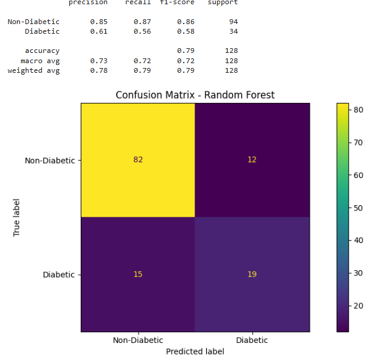

- Metrik Evaluasi

| Kelas         | Precision | Recall | F1-Score | Support |
| ------------- | --------- | ------ | -------- | ------- |
| Non-Diabetic  | 0.85      | 0.87   | 0.86     | 94      |
| Diabetic      | 0.61      | 0.56   | 0.58     | 34      |
| **Accuracy**  |           |        | **0.79** | 128     |
| Macro Average | 0.73      | 0.72   | 0.72     | 128     |
| Weighted Avg  | 0.78      | 0.79   | 0.79     | 128     |

Model Random Forest memberikan performa yang baik untuk kelas Non-Diabetic, dengan f1-score sebesar 0.86. Namun, kemampuannya dalam mendeteksi pasien Diabetic masih belum optimal dengan f1-score sebesar 0.58. Secara keseluruhan, model ini mencapai akurasi 0.79.

### 6.3 Logistic Regression

  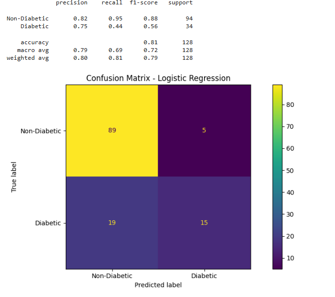

- Metrik Evaluasi

| Kelas         | Precision | Recall | F1-Score | Support |
| ------------- | --------- | ------ | -------- | ------- |
| Non-Diabetic  | 0.82      | 0.95   | 0.88     | 94      |
| Diabetic      | 0.75      | 0.44   | 0.56     | 34      |
| **Accuracy**  |           |        | **0.81** | 128     |
| Macro Average | 0.79      | 0.69   | 0.72     | 128     |
| Weighted Avg  | 0.80      | 0.81   | 0.79     | 128     |

Model Logistic Regression menunjukkan kinerja yang sangat baik dalam mengklasifikasikan kelas Non-Diabetic (f1-score 0.88), tetapi kurang optimal dalam mendeteksi Diabetic (f1-score 0.56). Meskipun begitu, model ini berhasil mencapai akurasi keseluruhan sebesar 0.81.

### 6.4 Catboost

  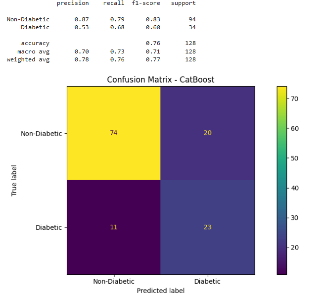

- Metrik Evaluasi

| Kelas         | Precision | Recall | F1-Score | Support |
| ------------- | --------- | ------ | -------- | ------- |
| Non-Diabetic  | 0.87      | 0.79   | 0.83     | 94      |
| Diabetic      | 0.53      | 0.68   | 0.60     | 34      |
| **Accuracy**  |           |        | **0.76** | 128     |
| Macro Average | 0.70      | 0.73   | 0.71     | 128     |
| Weighted Avg  | 0.78      | 0.76   | 0.77     | 128     |

Model CatBoost memiliki performa seimbang dengan f1-score yang cukup baik di kedua kelas. Meski akurasinya (0.76) sedikit lebih rendah dibanding beberapa model lain, model ini memberikan recall yang lebih tinggi pada kelas Diabetic (0.68), yang penting dalam konteks deteksi penyakit.

### Perbandingan Evaluasi Model

| Model                  | Accuracy | Precision (Diabetic) | Recall (Diabetic) | F1-Score (Diabetic) |
| ---------------------- | -------- | -------------------- | ----------------- | ------------------- |
| **K-Nearest Neighbor** | **0.81** | 0.67                 | **0.59**          | **0.62**            |
| Random Forest          | 0.79     | 0.61                 | 0.56              | 0.58                |
| Logistic Regression    | 0.81     | **0.75**             | 0.44              | 0.56                |
| CatBoost               | 0.76     | 0.53                 | **0.68**          | 0.60                |

- Kesimpulan dan Pemilihan Model terbaik

Model K-Nearest Neighbor (KNN) menjadi pilihan terbaik dalam dataset ini karena mampu memberikan performa paling seimbang dalam mendeteksi kelas Diabetic, yang merupakan fokus utama. KNN mencatatkan nilai f1-score tertinggi untuk kelas Diabetic sebesar 0.62, menunjukkan kemampuannya dalam menyeimbangkan antara kesalahan tipe I (false positives) dan tipe II (false negatives), yang sangat krusial dalam diagnosis penyakit seperti diabetes. Selain itu, model ini juga mencapai akurasi sebesar 0.81, yang merupakan salah satu yang tertinggi di antara seluruh model yang diuji, dan bahkan lebih unggul dibanding Logistic Regression dari segi recall dan f1-score untuk kelas Diabetic. Dibandingkan dengan CatBoost yang memang memiliki recall lebih tinggi (0.68), precision-nya justru rendah (0.53), sehingga f1-score-nya tetap lebih rendah dari KNN. Random Forest pun menunjukkan performa yang lebih rendah secara keseluruhan pada kelas Diabetic. Oleh karena itu, dengan mempertimbangkan keseimbangan antar metrik dan pentingnya deteksi tepat terhadap pasien diabetes, KNN adalah model yang paling layak dipilih.

## 7. Menjawab Problem Statements
### 1. Seberapa besar pengaruh kadar glukosa darah dan indeks massa tubuh (BMI) terhadap risiko seseorang menderita diabetes?

  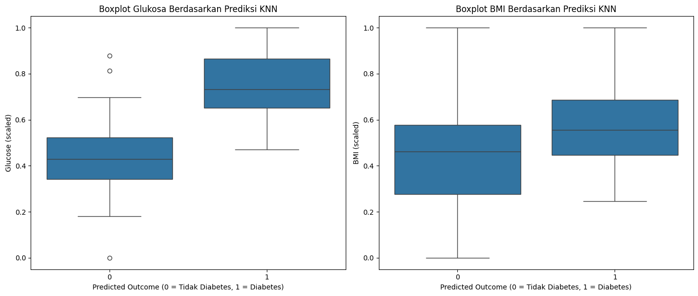

Interpretasi:

1. Pengaruh Glukosa terhadap Prediksi Risiko Diabetes
  - Boxplot Glukosa menunjukkan perbedaan yang jelas antara pasien yang diprediksi menderita diabetes (Predicted Outcome = 1) dan yang tidak (Predicted Outcome = 0). Nilai median glukosa pada kelompok yang diprediksi diabetes berada pada kisaran yang jauh lebih tinggi dibandingkan kelompok non-diabetes. Selain itu, rentang interkuartil (IQR) pasien diabetes juga bergeser ke arah nilai glukosa yang lebih tinggi. Hal ini menunjukkan bahwa kadar glukosa darah sangat berpengaruh dalam menentukan prediksi risiko diabetes oleh model KNN.
 - **kesimpulan :** Perbedaan ini mengindikasikan bahwa semakin tinggi kadar glukosa seseorang, semakin besar kemungkinan ia diprediksi memiliki diabetes oleh model. Dengan kata lain, glukosa merupakan salah satu fitur paling dominan dalam pengambilan keputusan klasifikasi KNN pada dataset ini.

 2. Pengaruh BMI terhadap Prediksi Risiko Diabetes
    
  - Distribusi BMI berdasarkan prediksi KNN menunjukkan bahwa pasien yang diprediksi diabetes cenderung memiliki BMI yang sedikit lebih tinggi dibandingkan pasien yang diprediksi tidak diabetes. Meskipun demikian, terdapat tumpang tindih yang cukup besar antara kedua kelompok, terutama pada rentang IQR dan sebaran nilai BMI secara keseluruhan.
  - kesimpulan : meskipun BMI turut berkontribusi dalam prediksi risiko diabetes, pengaruhnya tidak sekuat glukosa. BMI lebih bersifat sebagai faktor pendukung, bukan penentu utama dalam keputusan model KNN. Dengan demikian, BMI tetap relevan, tetapi kadar glukosa lebih kuat dalam membedakan risiko diabetes.

### 2. Bagaimana interaksi antara usia, kadar glukosa, dan BMI memengaruhi kemungkinan seseorang menderita diabetes?
    

  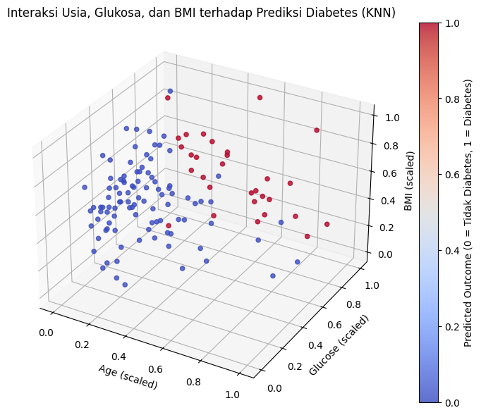

intepretasi:

Dari visualisasi 3D di atas, dapat dilihat bahwa individu dengan kadar glukosa tinggi (di atas 120 dalam skala standar) dan BMI yang tinggi (sekitar 35 ke atas) lebih banyak diprediksi menderita diabetes (ditunjukkan oleh titik-titik berwarna merah). Ini menunjukkan bahwa kadar glukosa dan BMI memiliki kontribusi signifikan terhadap peningkatan risiko diabetes.

Selain itu, usia juga tampak berperan, walaupun tidak sekuat glukosa dan BMI. Individu dengan usia lebih tua yang juga memiliki glukosa dan BMI tinggi cenderung lebih banyak terklasifikasi sebagai penderita diabetes. Namun, pada individu dengan usia muda, meskipun BMI tinggi, jika glukosa rendah, kemungkinan besar diprediksi tidak menderita diabetes.

Dengan akurasi model sebesar 81.125%, dapat disimpulkan bahwa model KNN mampu mengenali pola keterkaitan antara kombinasi usia, kadar glukosa, dan BMI terhadap risiko diabetes secara cukup baik. Visualisasi ini menguatkan bahwa kadar glukosa dan BMI adalah dua variabel yang sangat memengaruhi hasil prediksi diabetes, dengan usia berperan sebagai faktor pendukung.

### 3. Apakah kombinasi kadar glukosa dan riwayat keluarga (Diabetes Pedigree Function) dapat digunakan untuk memprediksi diabetes secara akurat?
    

  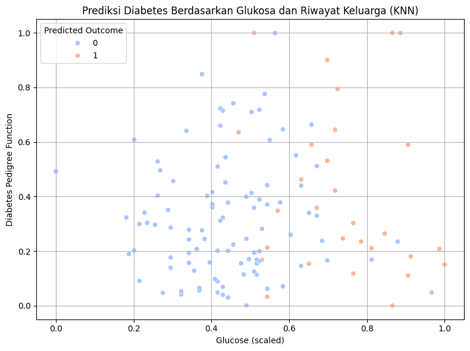

Interpretasi:

Kadar glukosa tinggi berkorelasi kuat dengan prediksi diabetes
Titik berwarna merah (Predicted Outcome = 1) cenderung terkonsentrasi di sisi kanan grafik, yaitu pada kadar glukosa yang tinggi (sekitar di atas 130). Ini menunjukkan bahwa semakin tinggi kadar glukosa seseorang, semakin besar kemungkinan model memprediksi bahwa orang tersebut menderita diabetes.

Riwayat keluarga (DPF) tidak terlalu dominan sebagai faktor prediksi tunggal
Titik merah dan biru tersebar di berbagai nilai DPF, baik rendah maupun tinggi. Ini berarti bahwa DPF sendiri kurang memberikan perbedaan yang jelas dalam prediksi outcome, kecuali bila dikombinasikan dengan glukosa tinggi.

Interaksi glukosa & DPF memberi gambaran yang lebih lengkap
Meskipun DPF tidak terlalu dominan sendiri, ketika digabungkan dengan glukosa tinggi, prediksi diabetes menjadi lebih kuat. Contohnya: di area kanan bawah (glukosa tinggi, DPF rendah), tetap banyak prediksi diabetes.

### Kesimpulan

Kombinasi kadar glukosa dan riwayat keluarga (DPF) memang bisa digunakan untuk memprediksi diabetes, namun glukosa memiliki pengaruh yang jauh lebih besar dalam keputusan model KNN.

# Referensi

1. Rusdi, M. S. (2020). Hipoglikemia Pada Pasien Diabetes Melitus. Journal Syifa Sciences and Clinical Research (JSSCR), 2(2), 83-90.
2. https://ditpui.ugm.ac.id/diabetes-penyebab-kematian-tertinggi-di-indonesia-batasi-dengan-snack-sehat-rendah-gula/ (diakses pada tanggal 23 Mei 2025)
3. International Diabetes Federation (IDF). (2021). Indonesia - International Diabetes Federation. Diakses dari https://idf.org/our-network/regions-and-members/western-pacific/members/indonesia/

© 2025 Firda Humaira
